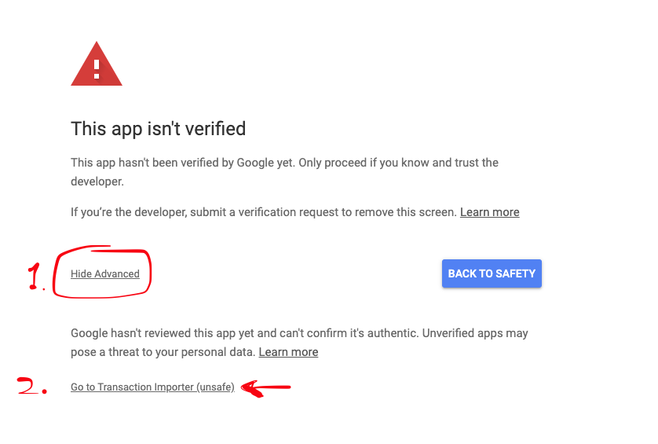

# Fire Repository

This resository contains some tools that I create to manage related things to FIRE.

At this moment that is the automatic transaction importer.

To install the extension find the latest release on the [releases page here](https://github.com/melledijkstra/fire/releases).

For the latest release find the `extension.zip`.

1. Download the `extension.zip` and unzip the file somewhere on your computer where you like it.

Unzip it and you should have a folder called `extension`. This will be the folder you have to install into chrome.

2. Go to [chrome://extensions/](chrome://extensions/) and enable `Developer mode`

3. Click `Load unpacked` and navigate to the **unzipped** folder! (not the .zip but the `extension` folder from earlier)

You should now have the extension installed.

**When you get the following screen when authorizing the extension just click** `Advanced` **and continue**

